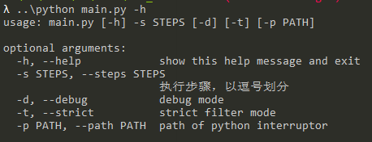

# 使用方法

## 清除数据

```
cd Web_validation
```

先清除路径下的`datas`文件

这里使用`..\python`的原因是因为项目中打包了一个独立的python环境，避免了python版本不一致导致的一系列问题

```
..\python clean_all_datas.py
```


## 运行脚本

运行脚本， 参数`1,2,3,4`是步骤

1. 解密步骤
2. 外网过滤步骤
3. 截图步骤
4. 按host文件分发图片步骤

```python
..\python main.py -s 1,2,3,4
```


## 参数介绍



> - -s 步骤选择，按逗号分割，可支持独立执行某个步骤，只需要将输入数据放到指定文件夹中
>
> - -d 调试模式，会打印出子脚本的调试信息
>
> - -t 严格过滤模式，在第二步外网过滤的过程中，会过滤掉外文网站（大部分外文网站访问速度较慢，在截图的时候需要加载完所有页面元素，截图所需时间变长，降低截图效率）
>
> - -p 指定python可执行程序所在位置，默认是`..\python.exe`