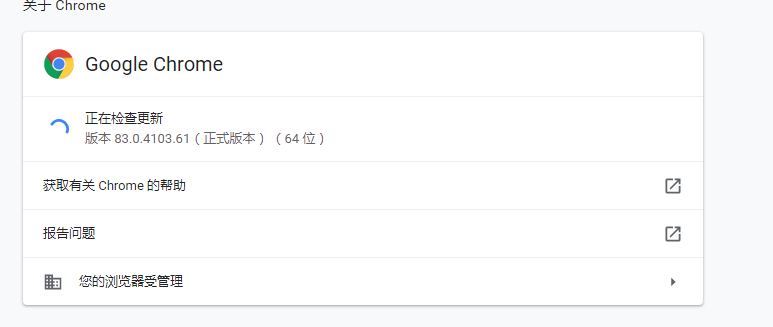
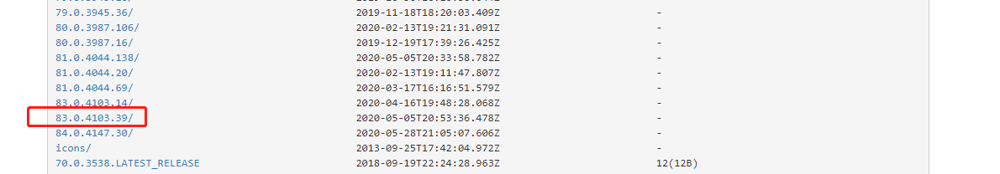
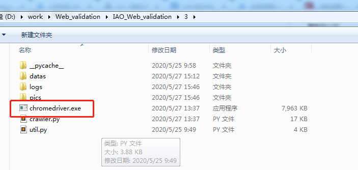

# 注意

**记得关掉杀毒软件，360会误报误杀**

# 部署

## 解压

将Web_validation压缩包，解压缩到`D:\work`目录下,确保 `D:\work\Web_validation\Python3.7.6\python.exe`存在

>  **一般推荐解压到固定目录下**

Windows下运行cmd，打开一个CMD命令行窗口, 检查方式

```
D:\work\Web_validation\Python3.7.6\python.exe --version
```

如输出`Python3.7.6`则安装正确

## 设置临时环境变量

如不想使用绝对路径，可以设置环境变量

```
set PATH=D:\work\Web_validation\Python3.7.6;%PATH%
```


## 配置chromedriver

由于截图脚本需要使用浏览器进行截图，因此需要使用`chromedriver`

每个人的Chrome版本不一致因此对应的`chromedriver`版本也不一致，需要自行下载并替换


首先查看自己Chrome的版本

点击Chrome的右上角


点击`关于Google Chrome`



然后去[该网址](https://npm.taobao.org/mirrors/chromedriver)下载对应版本的chromedriver，我的Chrome版本是83.0.4103.61因此下载



下载后解压到`IAO_Web_validation\3`，替换掉原本的`chromedriver.exe`



# 使用方法

## 清除数据

```
cd IAO_Web_validation
```

先清除路径下的`datas`文件

这里使用`python`的原因是因为项目中打包了一个独立的python环境，避免了python版本不一致导致的一系列问题

```
python clean_all_datas.py
```


## 运行脚本

### 运行前

一般我们拿到的是从全文跑出来的，加密的tgz格式的数据，将数据放在`1\datas`中即可

### 运行

运行脚本， 参数`1,2,3,4,5`是步骤

1. 解密步骤
2. 外网过滤步骤
3. 截图步骤
4. 图片分类
5. 按host文件分发图片步骤

```python
python main.py -s 1,2,3,4,5
```

支持从指定步骤开始运行，如

```
python main.py -s 1
python main.py -s 4
python main.py -s 2,3
python main.py -s 3,4
```


# 检查结果

跑完之后结果会放在`IAO_Web_validation\ret`文件中，一个`csv`文件会对应一个图片文件夹，如

- 00000_ret.csv（过滤之后的文件）
- 00000_ret_host（对应的图片文件夹）


# 参数介绍

> 必选参数
>
> - -s 步骤选择，按逗号分割，可支持独立执行某个步骤，只需要将输入数据放到指定文件夹中
>
> 可选参数
>
> - -d 调试模式，会打印出子脚本的调试信息
> - -p 指定python可执行程序所在位置，默认是`..\python.exe`
> - -t 严格过滤模式，在第二步外网过滤的过程中，会过滤掉外文网站（大部分外文网站访问速度较慢，在截图的时候需要加载完所有页面元素，截图所需时间变长，降低截图效率）
> - -w 使用反向关键词进行过滤。当数据量较大的时候使用反向关键词往往能滤掉大量数据，但是也会存在过滤掉赌博网站的情况，因此在数据量比较小的时候慎用

